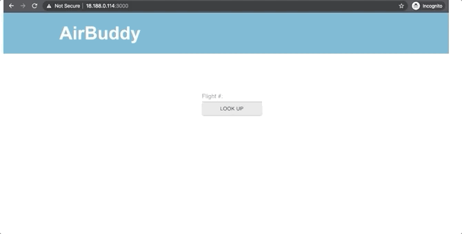

# Air Buddy Backend


## Inspiration
Have you ever gotten on a plane, lonely and sad, only to be seated next to people who grumble and pretend you're not even there? With Air Buddy, you can choose not to be alone!

Have you ever tried to sleep the whole flight, only to be constantly interrupted by your seat neighbor? Now you can choose to sit next to someone who also prefers silence!

## What it does
Air Buddy lets you select who you sit next to on a plane by pulling up their status when you are purchasing your ticket. Each seat is marked as "talkative" or "taciturn" to indicate openness to new conversations and encounters!

Purchase your seat from a certified Air Buddy vendor and this wealth of information will be available to you!

## How we built it
The Air Buddy team built this app to hook up with the Amadeus API, with the front-end in React and back-end in Node and Mongo. The app was deployed using AWS.

## Challenges
The team ran into interesting data inconsistency issues. Some airlines submit their data with plane seat rows being 0-indexed, while others are 1-indexed. There is also variation in whether seat coordinates are presented in x/y or y/x order. These inconsistencies were handled using some safety nets on the back-end.

## Accomplishments
Our app is simple--we know booking a flight is already time-consuming and annoying. The extra functionality we provide sits right on top of a normal seat map, providing a seamless, pleasant experience.

Our app is robust--it will render a seat map for any plane of any size, whether the data is 0- or 1- indexed, and whether the x- and y-coordinates of seats are reversed.

## What's next for Air Buddy
The next versions of Air Buddy will provide more details about others who have purchased seats around you. Are you single and hoping to meet someone special in the air? Look out for version 2.0, coming soon!

## View presentation
https://docs.google.com/presentation/d/1Rf-t3kKsLWSvWy2QHTDMif0cr6iie6Fg11-XQYjTtqE/edit#slide=id.g7db6bce217_2_0


# GETTING STARTED 
To get started, create a file named `secrets.json` in the root directory with contents

```json
{
  "AMADEUS_API_KEY": "<your-api-key-here>",
  "AMADEUS_API_SECRET": "<your-api-secret-here>"
}
```

filling in your real key and secret.

If you don't already have a MongoDB server running locally, you can start one with

```
./run-mongo.sh
```

To start the server,

```
npm start
```
